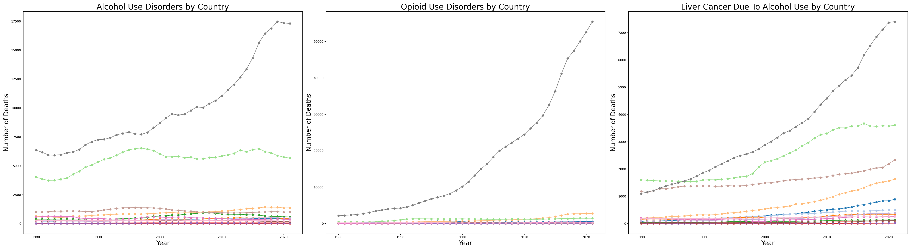
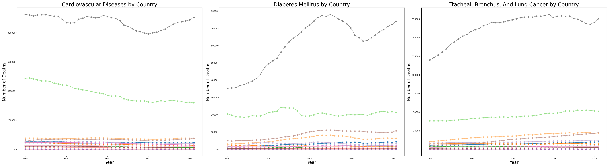

# Exploratory Data Analysis on Life Expectancy

Group 1 - Caitlin Hartley, Kevin Zhou, Rajamani Muthuraman, Rituparna Nandi
***

## Proposal & Background
While life expectancy is generally recognized to be positively correlated with GDP and other traditional measurements of economic development, there exist noticeable differences in life expectancy even among developed economies such as the high-income member countries of the OECD. What other factors, in addition to GDP, may significantly impact life expectancy, thereby giving rise to the differences in life expectancy seen among the cohort of deveoped countries?

***

## Project Overview
In order to obtain detailed data regarding life expectancy, GDP, and other potentially relevant health, social, and economic factors that spanned a long enough time period to be able to observe significant changes, we looked to several different sources. After using pandas to clean each obtained dataset, then merging them with the core life expectancy dataset, we visualized data using the matplotlib and plotly libraries.

### [Presentation Link](https://docs.google.com/presentation/d/1_NJrfP-YOKviRvoZGBxZmtLVZ576CRU_seQEoIyvTLk/edit#slide=id.g27839e5b07d_1_50)
***

## Data Sources and Cleaning

We used a curated dataset found on Kaggle, which contained data sourced from WHO, to explore variables that may impact life expectancy. While the data selection and range was mediocre, it gave us an idea to explore the variation in life expectancy among countries. An exploratory analysis of countries that had experienced the greatest and the least increase in life expectancy during the data's time period allowed us to narrow our focus to variation in life expectancy between countries at similar development profiles.
We also explored the difference in life expectancy between men and women as well as over the time period in which data was readily available from the UN World Population Prospects 2024 data report. However, the analysis was deemed to be only tangentially related to our main question.
Raw data is saved in /Resources/ directory. It includes:
- Life expectancy data since 1950 from the UN
- Causes of death data from the Global Burden of Disease study carried out by the Institute for Health Metrics and Evaluation (IHME) at the University of Washington
- Health expenditure data from the WHO
- GDP data from the Maddison Project Database 2020 at the University of Groningen
- Health expenditure data gathered via API request from the OECD, and healthcare insurance coverage data downloaded from the OECD database
- Assorted socioeconomic global development indicators from the World Bank World Development Indicators database

Processes for cleaning raw data are saved in /cleaning_code/ directory. Cleaned data has been outputted to csv and saved in the /output/csv/ directory.
Since multiple data sources were used, the merge_master notebook in the parent directory was used to merge the cleaned indicator data (health, GDP, etc.) to the life expectancy data based on country and year.
***
## Analysis
Processes for analyzing the output, cleaned data to obtain conclusions are saved in /analysis/ directory and charts are saved in /output/graphs/ directory.
Our analysis focused on Life Expectancy for OECD countries, looking at variables such as GDP, health expenditure, healthcare coverage, and health factors such as deaths caused by substance abuse, diseases, and injuries. We dealt with the main 
question - Why do OECD countries have variation in life expectancy? Specifically, why does the US have lower life expectancy compared to other wealthy countries in more recent years?

- We picked the top 15 wealthiest countries based on 2021 GDP and graphed how life expectancy changed over time. We observe there is a steady rise in life expectancy across the top 15 wealthiest countries. However, the United States has experienced a stagnation in life expectancy over the past approximately 20 years

### Life Expectancy Over Time

- We did a summary statistics analysis for the same 15 countries, showing the US has the lowest average life expectancy over the past 20 years. Additionally, the US has the lowest variation in life expectancy, exemplifying that stagnation while other countries have increased.
  

### Life Expectancy vs GDP

- We then looked at how life expectancy relates to GDP. The correlation between GDP per Capita and Life Expectancy is 0.7, indicating a strong, positive correlation exists between these two variables.
  

### Life Expectancy vs Health Expenditure

- Next we delved into health expenditure to explore the relationship with life expectancy. This analysis showed that over recent years, the United States has increasing health expenditure per capita, but stagnating life expectancy compared to other wealthy OECD countries.
  

- The correlation graph between life expectancy and health expenditure shows that United States is an outlier with very high health expenditure per capita but low life expectancy compared to other wealthy OECD countries.
  

### Healthcare Coverage in Wealthiest OECD countries

- Looking at healthcare coverage in OECD countries, it is clear the US has the lowest healthcare coverage, with most countries at about 100% coverage. The graph below is for mandated government health coverage. 

### Health Outcomes in OECD Countries

- Further investigating , we explored the different rates of death due to disease and injuries in the US, and how this correlated with life expectancy. The causes of death and life expectancy have a strong negative correlation.

***
## Conclusions

When looking into life expectancy in OECD countries, we found the the US life expectancy has stagnated over the past 20 years while other countries have continued to increase. We explored different variables and found that GDP and healthcare expenditure have a positive relationship with life expectancy. Since these factors were positively correlated but didn't explain why US life expectancy was lower, we dug deeper. We found two different factors that could potentially explain some of the discrepancy: The US has much lower healthcare coverage compared to the other countries in our study. Additionally, and perhaps related, there are much higher rates of death related to various diseases and injuries. This could explain part of the reason why life expectancy is lower in the US, but because life expectancy is related to so many things, there are many other options and routes to explore. 
